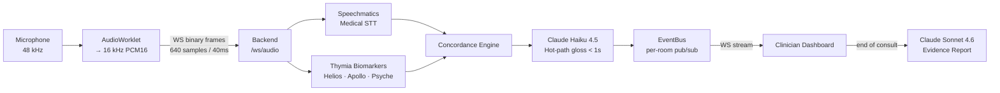
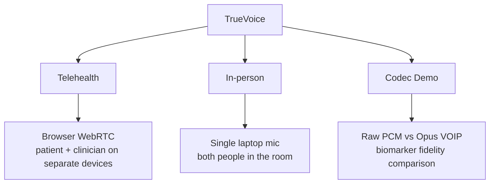

# TrueVoice


**Clinical voice intelligence that listens for what patients don't say.**

Built at the [Voice AI Hack](https://lu.ma/voiceaihack) (London, 2026) — **Voice & Medical** track, sponsored by Thymia and Speechmatics.

Patients routinely minimise symptoms during GP consultations: "I'm fine, just a bit tired." TrueVoice catches the gap between what they say and what their voice reveals — in real time, with no recording stored.

---

## How It Works

Audio is captured in the browser, downsampled to 16 kHz, and streamed over WebSockets to a FastAPI backend. Three parallel services analyse each utterance: Speechmatics medical STT produces the transcript; Thymia's Helios, Apollo, and Psyche models extract voice biomarkers; and a concordance engine matches minimisation phrases. When text and biomarkers diverge, Claude flags the moment and glosses it for the clinician. At the end of the consultation, Claude synthesises a one-page evidence report.



### Signal pipeline

| Stage | Service | Target latency |
|---|---|---|
| Medical transcription | Speechmatics RT | ~200 ms |
| Distress / stress score (Helios) | Thymia | per utterance |
| Mood / energy score (Apollo) | Thymia | per utterance |
| Affect breakdown (Psyche) | Thymia | per utterance |
| Minimisation flag gloss | Claude Haiku 4.5 | < 1 s |
| End-of-consult evidence report | Claude Sonnet 4.6 | on demand |

---

## Landing Page

The landing page explains the three consultation modes and links to the clinical dashboard.


---

## Clinician Dashboard

The live dashboard streams transcript, biomarker bars, and concordance flags as the consultation unfolds. Each flag shows the minimisation phrase, the biomarker evidence that triggered it, and Claude's clinical gloss.


---

## Evidence Report

At the end of the consultation, clicking **Generate Report** calls Claude Sonnet 4.6 with the full transcript, all biomarker readings, and every flagged moment. The output is a structured one-page brief the GP can review and attach to the patient record.


---

## Consultation Modes



---

## Tech Stack

**Backend:** Python 3.11 · FastAPI · WebSockets · `speechmatics-rt` · `thymia-sentinel` · Anthropic SDK · `uv`

**Frontend:** Next.js 16 · React 19 · TypeScript · Tailwind CSS 4 · AudioWorklet · `pnpm`

---

## Getting Started

### Backend
```bash
cd backend
uv sync
cp .env.example .env   # add SPEECHMATICS_API_KEY, THYMIA_API_KEY, ANTHROPIC_API_KEY
uv run uvicorn app.main:app --reload
```

### Frontend
```bash
cd frontend
pnpm install
cp .env.local.example .env.local   # set NEXT_PUBLIC_API_URL
pnpm dev
```

Open `http://localhost:3000`.

---

## Project Structure

```
TrueVoice/
├── backend/
│   ├── app/
│   │   ├── main.py              # FastAPI entry point
│   │   ├── models.py            # Pydantic event schema
│   │   ├── rooms.py             # Ephemeral session state
│   │   ├── eventbus.py          # Per-room async pub/sub
│   │   ├── services/
│   │   │   ├── speechmatics.py  # Medical STT
│   │   │   ├── thymia.py        # Voice biomarkers
│   │   │   ├── claude.py        # Flag gloss + report
│   │   │   └── concordance.py   # Minimisation detection
│   │   └── ws/
│   │       ├── audio.py         # Audio ingress WebSocket
│   │       └── dashboard.py     # Dashboard event stream
│   └── tests/
└── frontend/
    ├── app/
    │   ├── page.tsx             # Landing
    │   ├── in-person/           # In-person mode
    │   ├── report/[room]/       # Evidence report
    │   └── test-ui/             # Codec demo
    └── components/
        ├── Dashboard.tsx
        ├── BiomarkerLane.tsx
        ├── FlagCard.tsx
        └── TranscriptLane.tsx
```

---

## Team

| Name | GitHub |
|---|---|
| Joan Torres Gordo | [@joant11](https://github.com/joant11) |
| Indigo Luksch | [@IndigoLuksch](https://github.com/IndigoLuksch) |
| Oriol Morros Vilaseca | — |

---

> **Disclaimer:** TrueVoice is a research-grade hackathon prototype. It is not a medical device and should not be used for clinical diagnosis.
