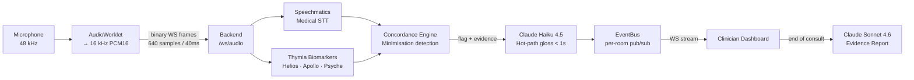
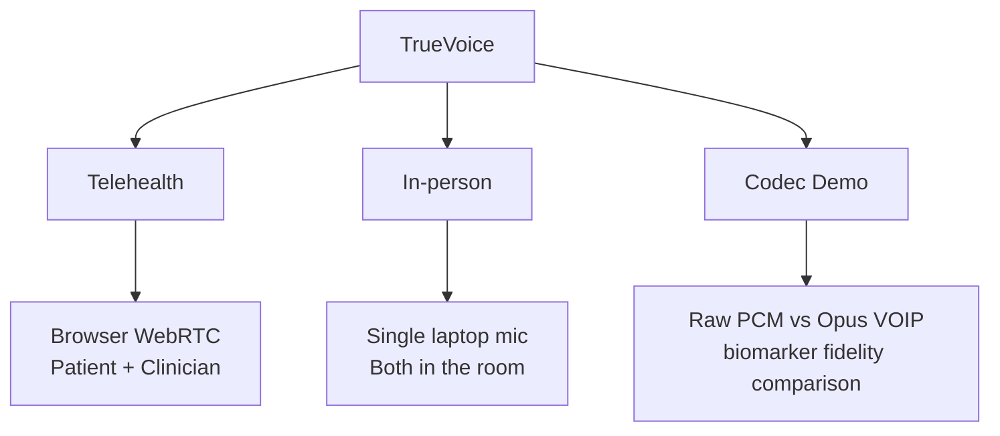

# TrueVoice


> **Clinical voice intelligence that listens for what patients don't say.**

TrueVoice detects patient minimisation in real-time GP consultations — the tendency to downplay symptoms ("I'm fine", "it's probably nothing") — by combining medical speech-to-text, voice biomarkers, and AI-powered clinical glossing.

Built at the **[Voice AI Hack](https://lu.ma/voiceaihack)** (London, 2026), **Voice & Medical** track, sponsored by Thymia and Speechmatics.

---

## The Problem

Patients routinely minimise their symptoms during consultations. A patient saying "I'm fine, just a bit tired" while exhibiting vocal stress and low energy biomarkers tells a different story. GPs miss these signals — not from lack of care, but because consultations are short and the cues are subtle.

TrueVoice surfaces that gap in real time.

---

## How It Works



### Signal pipeline

| Stage | Tool | Latency |
|---|---|---|
| Medical transcription | Speechmatics RT | ~200 ms |
| Distress / stress (Helios) | Thymia | per utterance |
| Mood / energy (Apollo) | Thymia | per utterance |
| Affect breakdown (Psyche) | Thymia | per utterance |
| Flag gloss | Claude Haiku 4.5 | < 1 s |
| End-of-consult report | Claude Sonnet 4.6 | on demand |

---

## Consultation Modes



---

## Tech Stack

**Backend** — Python 3.11 · FastAPI · WebSockets · `speechmatics-rt` · `thymia-sentinel` · Anthropic SDK

**Frontend** — Next.js 16 · React 19 · TypeScript · Tailwind CSS 4 · AudioWorklet

---

## Quickstart

### Backend
```bash
cd backend
uv sync
cp .env.example .env   # fill in API keys
uv run uvicorn app.main:app --reload
```

### Frontend
```bash
cd frontend
pnpm install
cp .env.local.example .env.local
pnpm dev
```

Open `http://localhost:3000`.

---

## Project Structure

```
TrueVoice/
├── backend/
│   ├── app/
│   │   ├── main.py          # FastAPI entry point
│   │   ├── models.py        # Pydantic event schema
│   │   ├── rooms.py         # Ephemeral session state
│   │   ├── eventbus.py      # Per-room pub/sub
│   │   ├── services/
│   │   │   ├── speechmatics.py
│   │   │   ├── thymia.py
│   │   │   ├── claude.py
│   │   │   └── concordance.py
│   │   └── ws/
│   │       ├── audio.py     # Audio ingress WebSocket
│   │       └── dashboard.py # Dashboard event stream
│   └── tests/
└── frontend/
    ├── app/
    │   ├── page.tsx          # Landing
    │   ├── in-person/        # In-person mode
    │   ├── report/[room]/    # Evidence report
    │   └── test-ui/          # Codec demo
    └── components/
        ├── Dashboard.tsx
        ├── BiomarkerLane.tsx
        ├── FlagCard.tsx
        └── TranscriptLane.tsx
```

---

## Team

| Name | GitHub |
|---|---|
| Joan Torres Gordo | [@joant11](https://github.com/joant11) |
| Indigo Luksch | [@IndigoLuksch](https://github.com/IndigoLuksch) |
| Oriol Morros Vilaseca | — |

---

## Hackathon

**Event:** [Voice AI Hack](https://lu.ma/voiceaihack) — London, 2026  
**Track:** Voice & Medical *(sponsored by Thymia & Speechmatics)*  
**Prizes:** £1,500 overall · £500 track winner  
**Sponsors:** Thymia · Speechmatics · Gradium · TinyFish · Render · Cursor · WhiteCircle

---

> **Disclaimer:** TrueVoice is a research-grade hackathon prototype. It is not a medical device and should not be used for clinical diagnosis.
