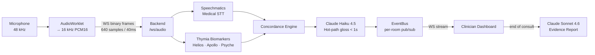
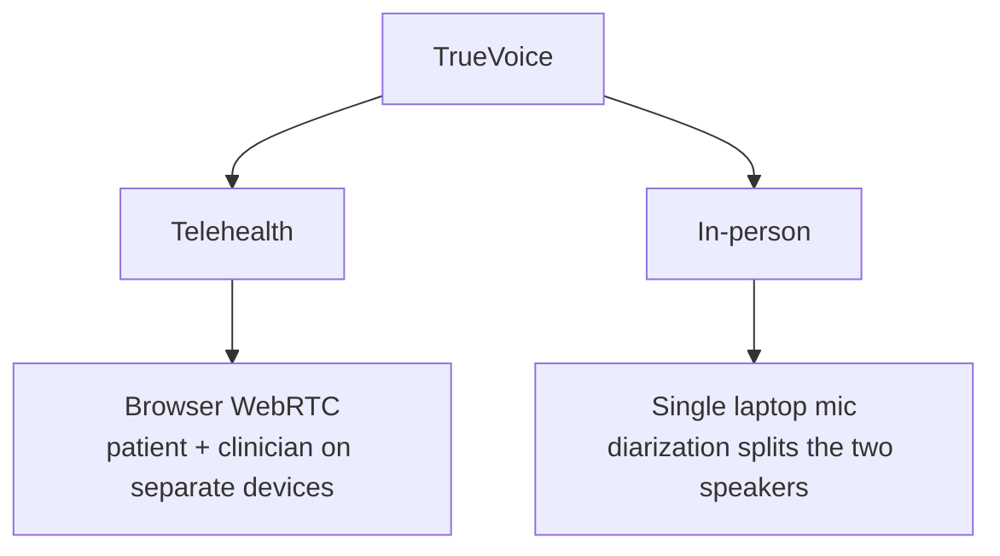
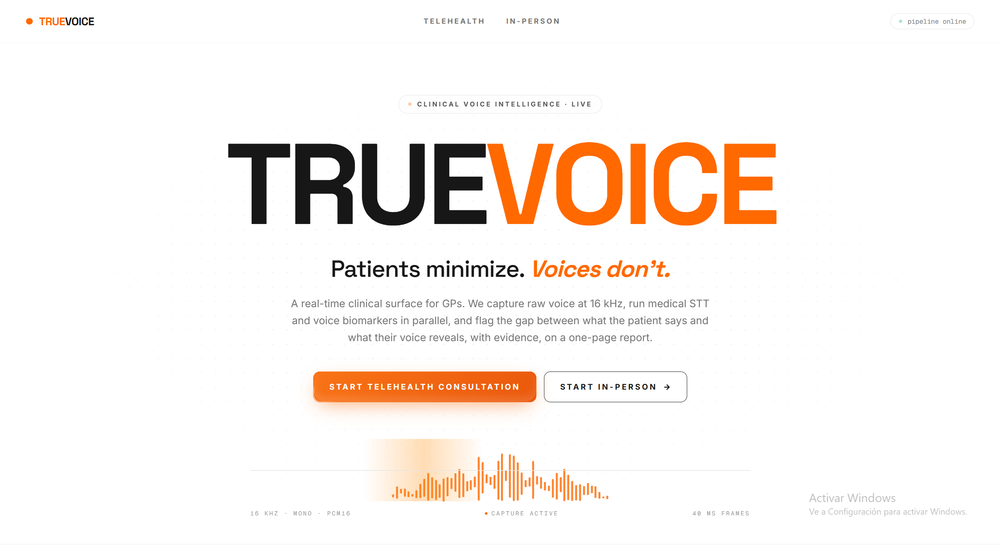
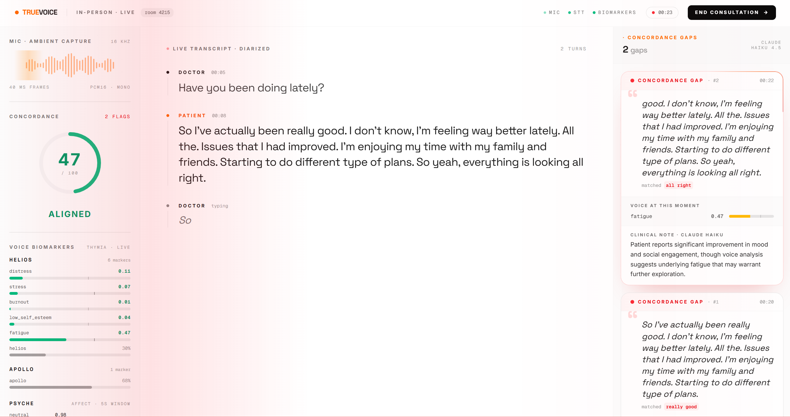
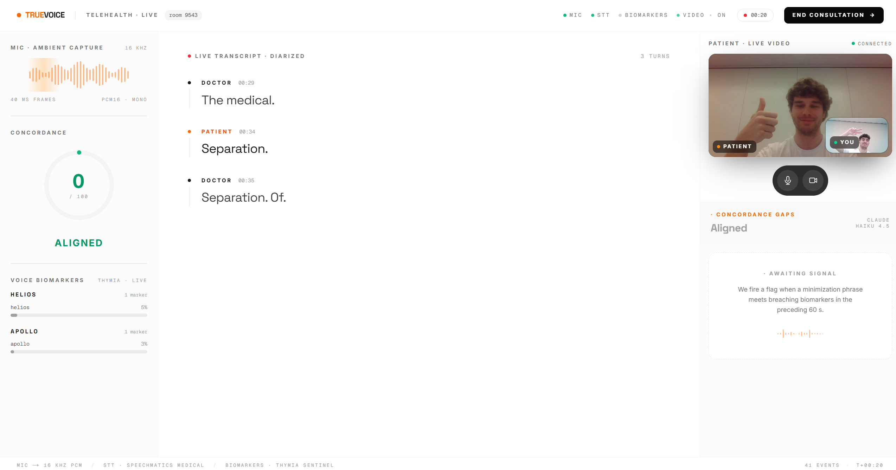
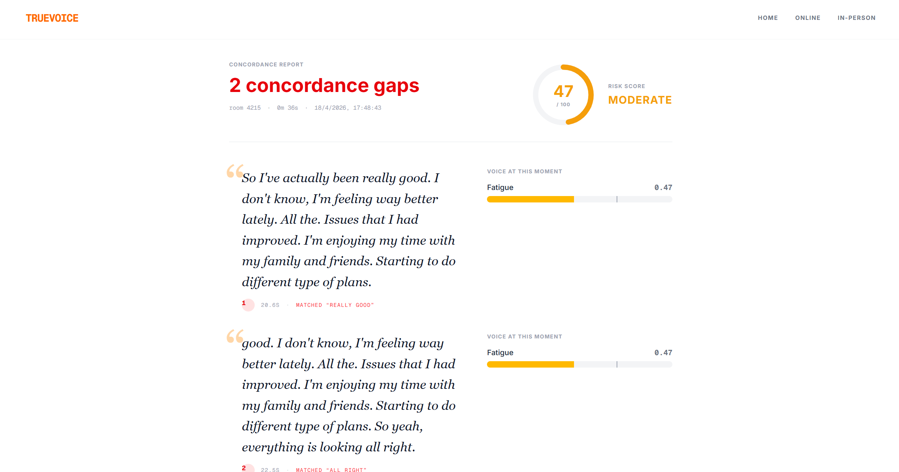

# TrueVoice

**Clinical voice intelligence that listens for what patients don't say.**

Built at the [Voice AI Hack](https://lu.ma/voiceaihack) (London, 2026) — **Voice & Medical** track, sponsored by Thymia and Speechmatics.

---

## What It Does

Patients routinely minimise symptoms during GP consultations: *"I'm fine, just a bit tired."* The words say one thing; the voice says another. TrueVoice catches that gap **in real time**.

During the consultation we run three signals in parallel:

1. **Medical STT** (Speechmatics) — an accurate clinical transcript, with speaker diarization for single-mic mode.
2. **Voice biomarkers** (Thymia Sentinel — Helios, Apollo, Psyche) — per-utterance distress, mood/energy, and affect scores.
3. **Concordance engine** — a rolling matcher over the transcript for minimisation phrases (*"I'm fine", "sleeping well"*), gated against the biomarker window.

When the patient's words and their voice diverge, Claude Haiku 4.5 writes a one-sentence clinical gloss (< 1 s) and it lands on the clinician's dashboard. At the end, Claude Sonnet 4.6 synthesises every flag, transcript, and biomarker reading into a one-page evidence report.

No audio is ever persisted. Rooms are ephemeral and live only in memory.

---

## How It Works

Audio is captured in the browser, downsampled to 16 kHz PCM16 in an `AudioWorklet`, and streamed to FastAPI over WebSockets as 40 ms binary frames. The backend fans each frame out to Speechmatics and Thymia in parallel, merges their outputs in the concordance engine, and publishes every event onto a per-room async event bus that the clinician dashboard subscribes to.




### Signal pipeline


| Stage                            | Service           | Target latency |
| -------------------------------- | ----------------- | -------------- |
| Medical transcription            | Speechmatics RT   | ~200 ms        |
| Distress / stress score (Helios) | Thymia            | per utterance  |
| Mood / energy score (Apollo)     | Thymia            | per utterance  |
| Affect breakdown (Psyche)        | Thymia            | per utterance  |
| Minimisation flag gloss          | Claude Haiku 4.5  | < 1 s          |
| End-of-consult evidence report   | Claude Sonnet 4.6 | on demand      |


---

## Consultation Modes

TrueVoice runs the same pipeline in two environments:

- **Telehealth** (`/online`) — patient and clinician on separate devices. A lightweight WebRTC signaling relay in the backend pairs them; patient audio is tee'd to the pipeline. The clinician's screen shows the video call *and* the live dashboard.
- **In-person** (`/in-person`) — one laptop on the desk. A single microphone captures both voices; Speechmatics speaker diarization (`max_speakers=2`) attributes each utterance to clinician or patient. The dashboard lives on a second monitor.




---

## Screenshots

### Landing page



### Clinician dashboard

*Live transcript lane, Helios/Apollo/Psyche biomarker bars, and concordance flag cards. Each flag pairs the minimisation phrase with the biomarker evidence that triggered it and Claude's gloss.*



### Telehealth call (GP view)

*The clinician's screen during a live telehealth consult. WebRTC video sits alongside the full diagnostic surface: patient tile, live diarized transcript, concordance meter, biomarker bars, and the gap panel waiting to fire when minimisation meets biomarker evidence.*



### Evidence report

*Clicking **Generate Report** at the end of the consult calls Claude Sonnet 4.6 with the full transcript, every biomarker reading, and every flag. The output is a structured one-page brief the GP can review and attach to the patient record.*



---

## Tech Stack

**Backend** — Python 3.11 · FastAPI · WebSockets · `speechmatics-rt` · `thymia-sentinel` · Anthropic SDK · `uv`

**Frontend** — Next.js 16 · React 19 · TypeScript · Tailwind CSS 4 · AudioWorklet · WebRTC · `npm`

**AI** — Claude Haiku 4.5 (`claude-haiku-4-5`) for sub-second gloss · Claude Sonnet 4.6 (`claude-sonnet-4-6`) for end-of-consult synthesis

---

## Getting Started

### Prerequisites


| Tool                             | Version                  | Why                                               |
| -------------------------------- | ------------------------ | ------------------------------------------------- |
| Python                           | ≥ 3.11                   | Backend runtime                                   |
| [uv](https://docs.astral.sh/uv/) | latest                   | Backend deps / runner                             |
| Node.js                          | ≥ 20                     | Frontend runtime                                  |
| npm                              | ≥ 10                     | Package install (lockfile is `package-lock.json`) |
| A modern browser                 | Chrome, Edge, Safari 17+ | `AudioWorklet` + microphone permission            |


### API keys

You need three keys before running anything:


| Variable               | Where to get it                                                                                  |
| ---------------------- | ------------------------------------------------------------------------------------------------ |
| `SPEECHMATICS_API_KEY` | [speechmatics.com](https://www.speechmatics.com) — sign up, create an API key under *API Access* |
| `THYMIA_API_KEY`       | [thymia.ai](https://www.thymia.ai) — request access to the Sentinel SDK                          |
| `ANTHROPIC_API_KEY`    | [console.anthropic.com](https://console.anthropic.com) — create a key under *API Keys*           |


### 1. Backend

```bash
cd backend
cp .env.example .env
# fill in the three keys in .env
uv sync
uv run uvicorn app.main:app --reload
```

Server listens on `http://localhost:8000`. Verify with:

```bash
curl http://localhost:8000/health
# → {"ok":true}
```

`backend/.env`:

```env
SPEECHMATICS_API_KEY=your-speechmatics-key
THYMIA_API_KEY=your-thymia-key
ANTHROPIC_API_KEY=your-anthropic-key
ALLOWED_ORIGINS=http://localhost:3000
```

### 2. Frontend

```bash
cd frontend
npm install
npm run dev
```

Open `http://localhost:3000`. The frontend proxies `/api/*` to the backend (see `next.config.ts`), so no env file is needed for local dev.

To point at a non-default backend, create `frontend/.env.local`:

```env
NEXT_PUBLIC_BACKEND_HTTP_URL=http://localhost:8000
NEXT_PUBLIC_BACKEND_WS_URL=ws://localhost:8000
```

---

## Using TrueVoice

### Telehealth

1. Clinician opens `http://localhost:3000/online` and clicks **Start as clinician** → a 4-digit room code is generated.
2. Share the code with the patient (out-of-band — text, email).
3. Patient opens `/online`, enters the code, clicks **Join as patient**, and grants microphone + camera permission.
4. WebRTC connects the call; patient audio is simultaneously streamed to the pipeline.
5. Clinician sees the live dashboard (transcript · biomarkers · flags) alongside the video tile.
6. End the call → click **Generate Report** to get the one-page brief.

### In-person

1. Open `http://localhost:3000/in-person` on a single laptop and click **Start session**.
2. Grant microphone permission. Both people speak into the same mic; Speechmatics diarization attributes utterances to clinician vs. patient.
3. Dashboard streams live to the same browser window (or a second monitor).
4. Click **Generate Report** at the end.

---

## Project Structure

```
TrueVoice/
├── backend/
│   ├── app/
│   │   ├── main.py              # FastAPI entry + middleware + routers
│   │   ├── config.py            # Pydantic settings / secret masking
│   │   ├── models.py            # Pydantic event schema (dashboard events)
│   │   ├── rooms.py             # Ephemeral in-memory room state
│   │   ├── eventbus.py          # Per-room async pub/sub + replay buffer
│   │   ├── api/
│   │   │   ├── rooms.py         # POST /api/rooms, GET /api/rooms/{id}
│   │   │   ├── report.py        # POST/GET /api/report/{room}
│   │   │   └── debug.py         # Opt-in debug endpoints
│   │   ├── services/
│   │   │   ├── distributor.py   # Fan-out 16 kHz frames to many consumers
│   │   │   ├── speechmatics.py  # Medical STT + speaker diarization
│   │   │   ├── thymia.py        # Helios / Apollo / Psyche biomarkers
│   │   │   ├── concordance.py   # Minimisation matcher + biomarker gating
│   │   │   └── claude.py        # Hot-path gloss + report synthesis
│   │   └── ws/
│   │       ├── audio.py         # /ws/audio/{role}/{room} ingress
│   │       ├── dashboard.py     # /ws/dashboard/{room} event stream
│   │       └── signaling.py     # /ws/signal/{role}/{room} WebRTC relay
│   └── tests/                   # pytest suite (unit + live integration)
└── frontend/
    ├── app/
    │   ├── page.tsx             # Landing
    │   ├── online/              # Telehealth lobby + /patient and /clinician rooms
    │   ├── in-person/           # Single-laptop mode
    │   └── report/[room]/       # Evidence report viewer
    ├── components/
    │   ├── Dashboard.tsx        # Composed live view
    │   ├── TranscriptLane.tsx
    │   ├── BiomarkerLane.tsx
    │   ├── FlagCard.tsx
    │   ├── ConcordanceMeter.tsx
    │   ├── ClinicianVideoPanel.tsx, VideoTile.tsx, MeetingControls.tsx
    │   └── ui/                  # Shared primitives (buttons, badges, effects)
    ├── lib/
    │   ├── audioCapture.ts      # Mic → AudioWorklet → WebSocket
    │   ├── dashboardSocket.ts   # Dashboard WS client w/ reconnect
    │   └── useVideoCall.ts      # WebRTC + signaling hook
    └── public/pcm-worklet.js    # 48 kHz → 16 kHz PCM16 downsampler
```

---

## API Surface


| Method | Path                                       | Purpose                                                      |
| ------ | ------------------------------------------ | ------------------------------------------------------------ |
| `GET`  | `/health`                                  | Liveness probe                                               |
| `POST` | `/api/rooms`                               | Create an ephemeral room, returns `{room_id, created_at_ms}` |
| `GET`  | `/api/rooms/{room_id}`                     | Check whether a room exists                                  |
| `POST` | `/api/report/{room_id}`                    | Trigger Claude Sonnet synthesis                              |
| `GET`  | `/api/report/{room_id}`                    | Fetch the generated report                                   |
| `WS`   | `/ws/audio/{role}/{room_id}?mode=inperson` | Binary 40 ms PCM16 frames in                                 |
| `WS`   | `/ws/dashboard/{room_id}`                  | JSON event stream out (with replay on connect)               |
| `WS`   | `/ws/signal/{role}/{room_id}`              | WebRTC signaling relay (telehealth)                          |


---

## Development

```bash
# Backend
cd backend
uv run pytest          # unit tests
uv run pytest -m integration   # live integration tests (slower)
uv run ruff check .

# Frontend
cd frontend
npm run lint
npm run build
```

---

## Team


| Name                  | GitHub                                           |
| --------------------- | ------------------------------------------------ |
| Joan Torres Gordo     | [@joant11](https://github.com/joant11)           |
| Indigo Luksch         | [@IndigoLuksch](https://github.com/IndigoLuksch) |
| Oriol Morros Vilaseca | [@omorros](https://github.com/omorros)           |


---

> **Disclaimer:** TrueVoice is a research-grade hackathon prototype. It is not a medical device and should not be used for clinical diagnosis.

